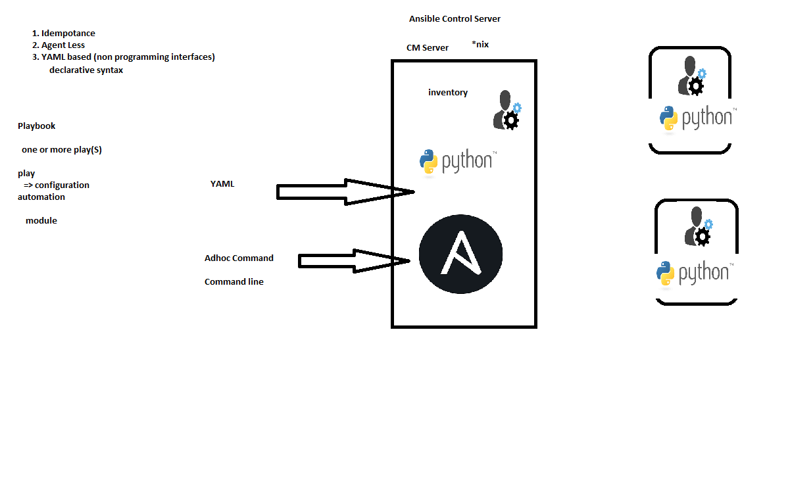

## Ansible Basics



## Modules
* Modules are unit of work in ansible
* These are actual workers
* Rest of all are supporting modules
* Ansible supports way too many modules
* How to find the right one?
  If i'm automating 
    * Linux Commands:
        * easiest: search <command> in ansible. eg 'service start httpd' query will be service in ansible

* Module: 
    * type
    * Different arguments/parameters
    * state
    * Module always tries to maintain state whenever executed

    ```
    ansible -m ping all
    ansible -m apt -a 'name=tree,state=present' all
    ```
    * Module for automation should be represented in YAML
