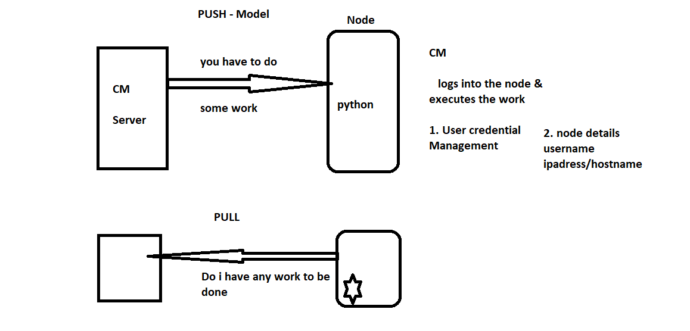

# Configuration Management

1. PUSH:
    * Ansible is a push model CM
    * Ansible requires user to login
    * Ansible requires python to be installed on all nodes

2. PULL:
    * Chef/Puppet is pull 
    * Chef requires agent to be installed on nodes
    * No user credentials required

