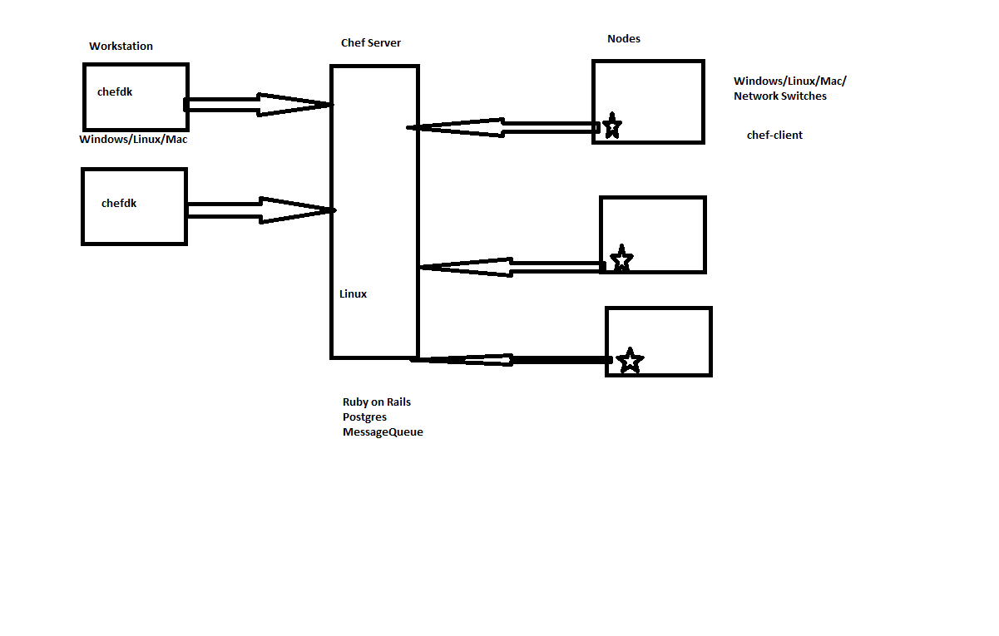

## Chef Overview



## SetUp

* Chef Server:
    * Has to be installed on any flavor of Linux
    * Two Modes
        * Self Hosted
            * Linux, free until node count <= 10
        * Hosted Chef
            * Chef Server is already installed. 
            * Create account [Refer](https://manage.chef.io/login)
            * Free till 5 nodes
            * Version is always latest

## Terms

* Bootstrap: 
    * Is process of installing chef-client & enabling communication to Chef Server
    * Two Ways
        * Manual 
        * Automatic


# Workstation Setup
* Prereq's:
    * [Choco](https://chocolatey.org/install)
        * Only windows
        ```
        # Launch PS as admin
        Set-ExecutionPolicy unrestricted
        ```
    * HomeBrew (Mac)
    * Git For Windows (Windows)
    ```
    choco install git -y
    ```
    * Visual Studio Code
    ```
    choco install vscode
    ```
* Chef dk installation:
    * [Link](https://docs.chef.io/install_dk.html)
    * Windows
    ```
    choco install chefdk -y
    ```

* Chef Node Setup
    * Get any linux machine with internet connection
    * Bootstrap
        ```
        knife bootstrap
        ```