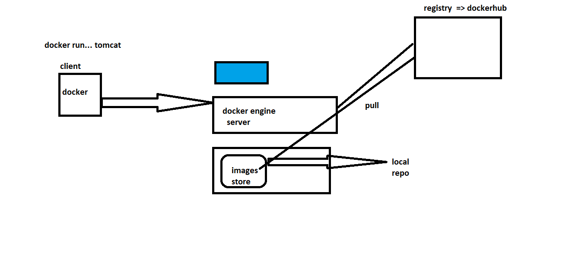

# Play with Docker

1. Execute the following command
```
docker run -d -p 8080:8080 tomcat
```

## What can we run inside containers
* Services
* Non Desktop 

* Stateless/Stateful

* Observation:
    * docker container gets ip address
    * docker container gets filesystem
    * docker container gets process tree

## Images
* Creating Images of your appplications

### Docker Installation
* Create a linux machine
* Execute following commands
```
curl -fsSL https://get.docker.com -o get-docker.sh
sh get-docker.sh
sudo -i

```
## Docker image to Container



