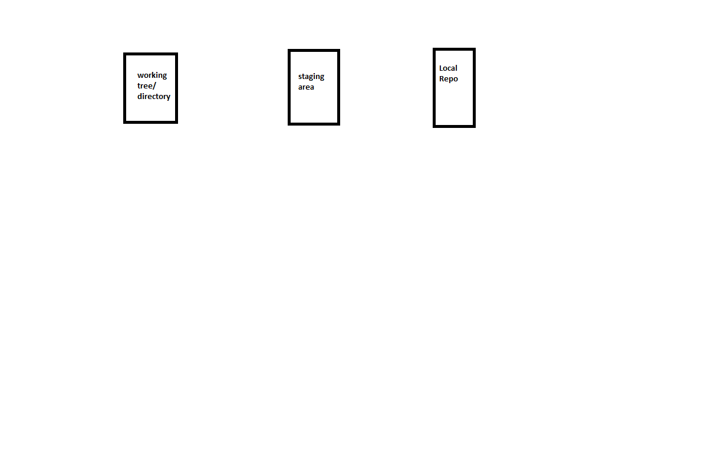
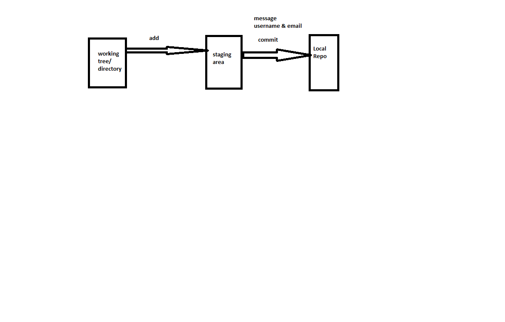

## Git Basics

### Three important phases


### QuickStart
1. Idenitfy or create a folder
2. Make this folder git repo (local rep)
```
git init
```
3. create some folders
```
mkdir src
mkdir test
mkdir docs
```
4. To know the status of what git has identified
```
git status
```
5. configure email & username
```
git config --global user.name 'shaikkhajaibrahim'
git config --global user.email 'qtdevops@gmail.com'
```
6. Add the changes to staging area. 
```
git add .
note: empty folder is not a change in git
```
7. Look at the status
```
git status
```
8. Move the change from staging area to local repo. This is called as commit
```
git commit -m <your message>
```
9. Check status & history
```
git status
git log
# git log shows the commit id , author message & date
```



