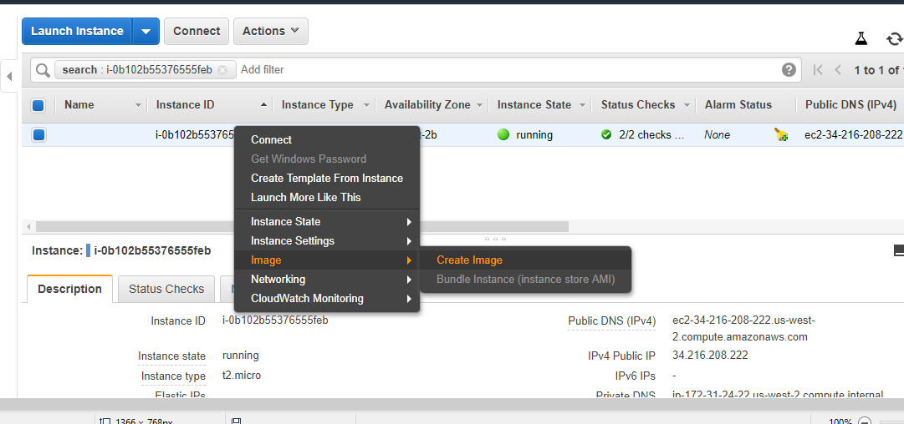

# Manually Creating Images

## What we want
* Ubuntu OS (>16.04) with git installed

## Where
* AWS:
1. Steps:
    * Create a EC2 machine with Ubuntu AMI
    * Login into machine & install git
        ```
        sudo apt-get update
        sudo apt-get install git -y
        sudo apt-get install tree -y
        ```
    * Create AMI
      
2. Four things to consider
    * AMI
    * Network
    * Harddisk
    * Login (Key Based Login)
    * Network Rules

