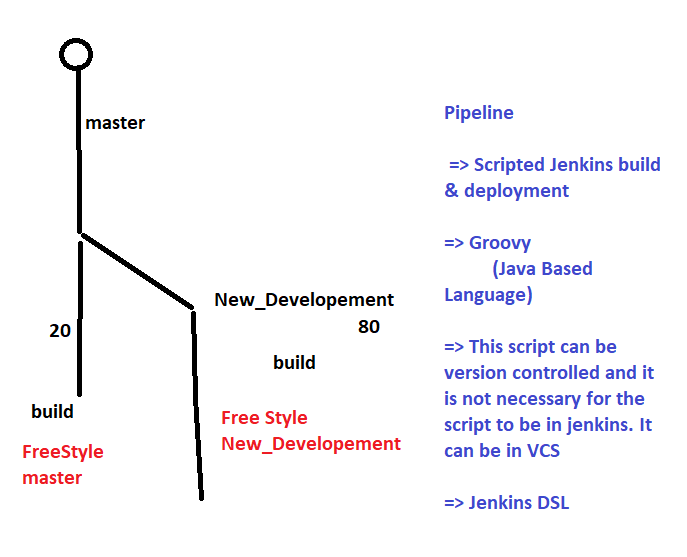

# Jenkins Pipelines

## Why Pipeline?


## What is Pipeline
* Scripted Jenkins build process written in Groovy (Jenkins DSL)
* These Scripts can be Version Controlled & Can be loaded from Git repository

## Components of Pipeline
* Node: 
    * This is the jenkins node where you want your job to run
    ```
    node('UBUNTU') 
    {

    } # run job on jenkins node with Label ubuntu

    node {

    } # run job anywhere
    ```
* Stage:
    * Build Process will be logically divided into stages
    ```
    stage('<STAGE NAME>') {

    }
    ```
    * Complete Script
    ```
    node('UBUNTU')
    {
        stage('GIT') 
        {
            // do something to get git clone
        }
        stage('package')
        {
            // do something to build & package your project (maven => mvn package)
        }
    }
    ```
