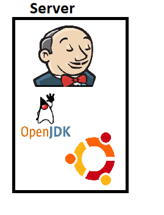

# Jenkins Setup

## Basic Jenkins

* Techonology:  Jenkins is developed in JAVA. As on today it works with Java 8. 
* What is Jenkins? : Jenkins is CRON/Scheduler on Steriods
* What can Jenkins run? : Anything from commandline

## Installing Jenkins

### Jenkins Standalone
* Server in Jenkins is considered as master


* Steps:
    1. Create a Ubuntu linux vm
    2. install Openjdk 8
        * [Link](https://www.digitalocean.com/community/tutorials/how-to-install-java-with-apt-on-ubuntu-18-04)
        ```
        sudo apt-get update
        sudo apt install openjdk-8-jdk -y
        java -version
        # set JAVA_HOME Environment variable
        sudo nano /etc/environment
        JAVA_HOME="/usr/lib/jvm/java-11-openjdk-amd64/bin/"
        # save the file
        source /etc/environment
        ```
    3. install jenkins: [Refer here](https://directdevops.blog/2019/01/04/installing-specific-lts-version-of-jenkins-on-ubuntu/)
    


