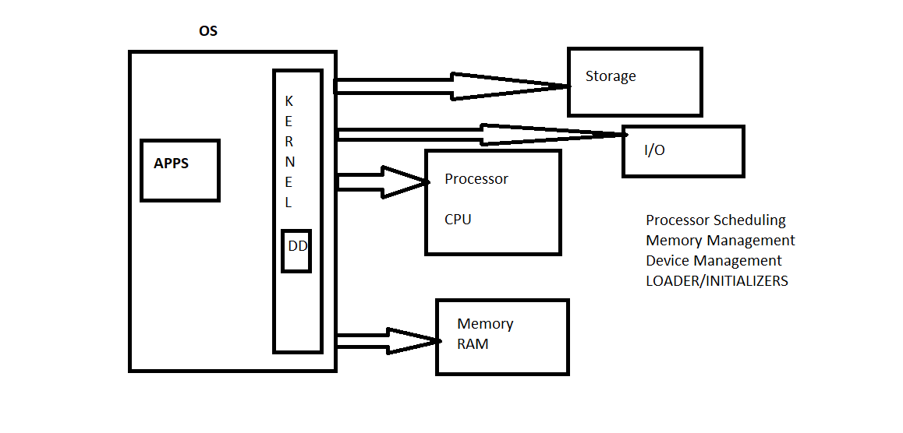
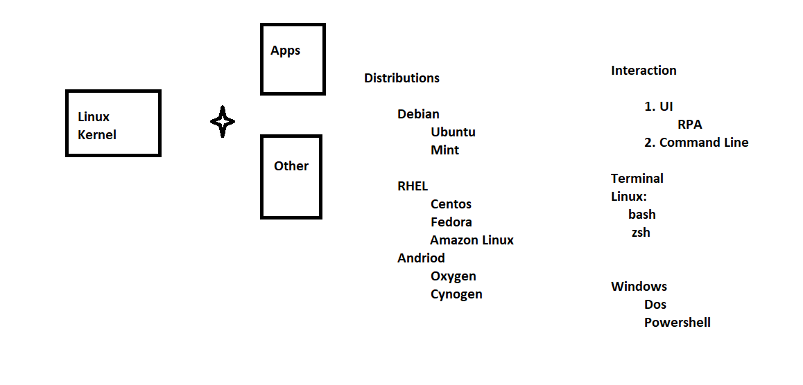

# Linux Basics

## Creating a Linux Machine

1. Install on your laptop/server
    * How? 
2. Virtual Machines
    * How?
    * Vagrant (Check it out)
3. Cloud
    * Amazon
        * Ubuntu
        * Centos
    * Azure
        * Ubuntu

## Connecting to Linux Machine
    * UI
    * Terminal
        * Connected using ssh clients
        * Linux/Mac: SSH Client is already available
        * windows:
            * SSH Client:
                * putty
                * Git Bash
                * Cygwin

## Editing files in linux
    * [Check this out](https://www.openvim.com/tutorial.html)