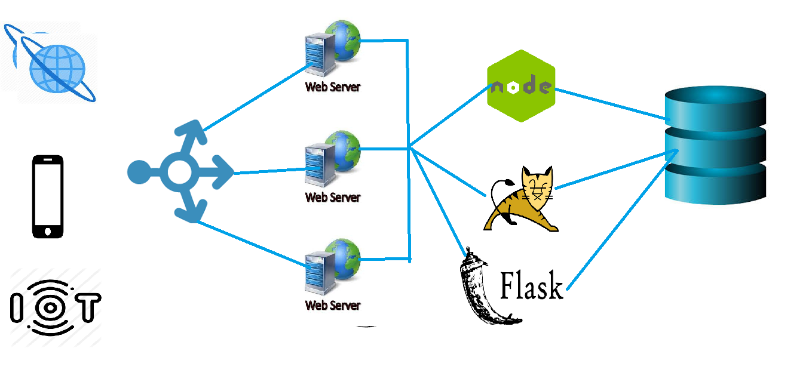
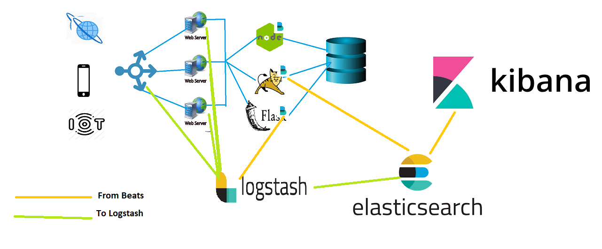

# Application/Log Monitoring

## Log Monitoring using Elastic Stack
* Elastic Search
    * Central Storage
* LogStash
    * Helps to parse logs
    * input
    * output
* Kibana
    * Front end 
    * dashboards
* Beats
    * software installed on machines where logs are generated

